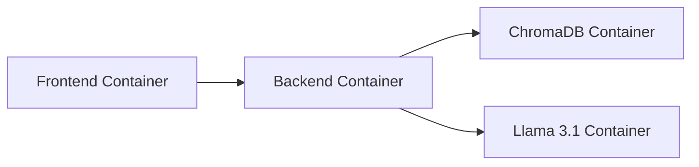

# Design Document

**Project Name:** PDF-Powered Q&A with Llama 3.1

**Document Version:** 1.1

---

## 1. Introduction

This document outlines the design of the PDF-powered question answering system using Llama 3.1. It encompasses system architecture, user interface design, backend components, and database schema.

## 2. System Architecture

The system adopts a client-server architecture with the following components:

### Components:

- **Frontend (Angular):** Handles user interactions, including PDF uploads and Q&A interface.
- **Backend (Python/LangChain):** Manages PDF processing, embedding generation, and communication with the language model.
- **Language Model (Llama 3.1):** Generates answers based on user queries and retrieved context.
- **Vector Database (ChromaDB):** Stores embeddings for efficient semantic search.

## 3. User Interface Design

### 3.1. Main Components

- **PDF Upload Section:**
  - Drag-and-drop area or file upload button.
  - Progress indicator for uploads.
  - List of uploaded documents with metadata (file name, upload date, size).

- **Question Input Area:**
  - Text input field for natural language questions.
  - "Ask" button to submit questions.

- **Answer Display Area:**
  - Displays answers generated by Llama 3.1.
  - Highlights relevant sections from original PDFs.
  - "View Source" button to access source PDFs.

### 3.2. Wireframes

*Include basic wireframes or mockups illustrating the layout of the components.*

### 3.3. Compliance Display Area
- Displays compliance status (Yes/No).
- Lists reasons for non-compliance when applicable.

## 4. Backend Components

### 4.1. PDF Processing Module

- **Functionality:** Extracts text from PDFs using PyPDF2.
- **Input:** Uploaded PDF files.
- **Output:** Extracted text data.

### 4.2. Document Chunking Module

- **Functionality:** Splits extracted text into semantically meaningful chunks using LangChain.
- **Input:** Extracted text data.
- **Output:** List of text chunks.

### 4.3. Embedding Generation Module

- **Functionality:** Generates embeddings for each text chunk using Sentence Transformers.
- **Input:** List of text chunks.
- **Output:** Embeddings for each chunk.

### 4.4. Knowledge Base Module

- **Functionality:** Stores embeddings and text chunks in ChromaDB and provides querying capabilities.
- **Input:** Embeddings and text chunks.
- **Output:** Relevant text chunks based on queries.

### 4.5. Question Processing Module

- **Functionality:** Generates embeddings for user questions using Sentence Transformers.
- **Input:** User's question.
- **Output:** Embedding for the question.

### 4.6. LLM Interaction Module

- **Functionality:** Constructs prompts incorporating user questions and retrieved context, interacts with Llama 3.1.
- **Input:** User's question, relevant text chunks.
- **Output:** Generated answer from Llama 3.1.

## 5. Database Schema

### 5.1 ChromaDB

ChromaDB organizes data using collections. A single collection will store embeddings and corresponding text chunks from all uploaded PDFs.

**Data Structure:**

- **Embedding:** Vector representation of a text chunk.
- **Text Chunk:** Extracted text segment from a PDF.
- **Metadata (Optional):** Information such as source PDF file, page number, etc.

## 6. API Design (Optional)

Define API endpoints if exposing system functionality:

- **`/upload`:** Upload PDF documents.
- **`/ask`:** Submit questions and receive answers.

## 7. Deployment Diagram

The system will be containerized using Docker and orchestrated with Docker Compose.

## 8. Security Considerations

- **Data Encryption:** Encrypt sensitive data at rest and in transit.
- **Access Control:** Implement authentication and authorization mechanisms.
- **Secure API Design:** Follow best practices to prevent vulnerabilities.

## 9. Future Considerations

- **Scalability:** Ensure the design supports scaling with increasing users and data.
- **Multi-Turn Conversations:** Enable interactive dialogues with the LLM.
- **Source Attribution:** Link answers to specific PDF pages for verification.

## 10. Conclusion

This Design Document serves as a blueprint for the "PDF-Powered Q&A with Llama 3.1" system, outlining key components, interactions, and technologies to guide the development team through implementation.
